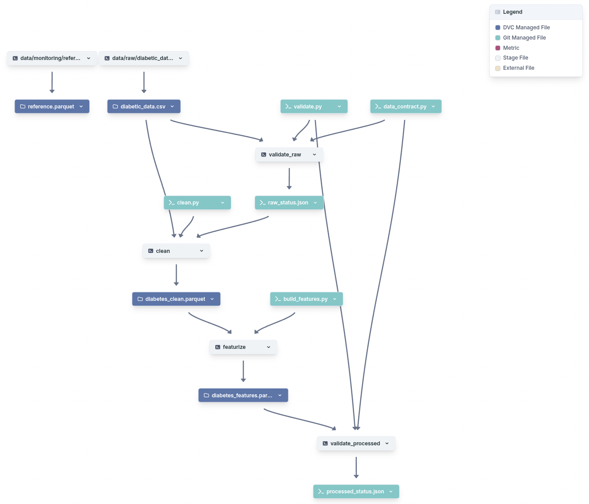
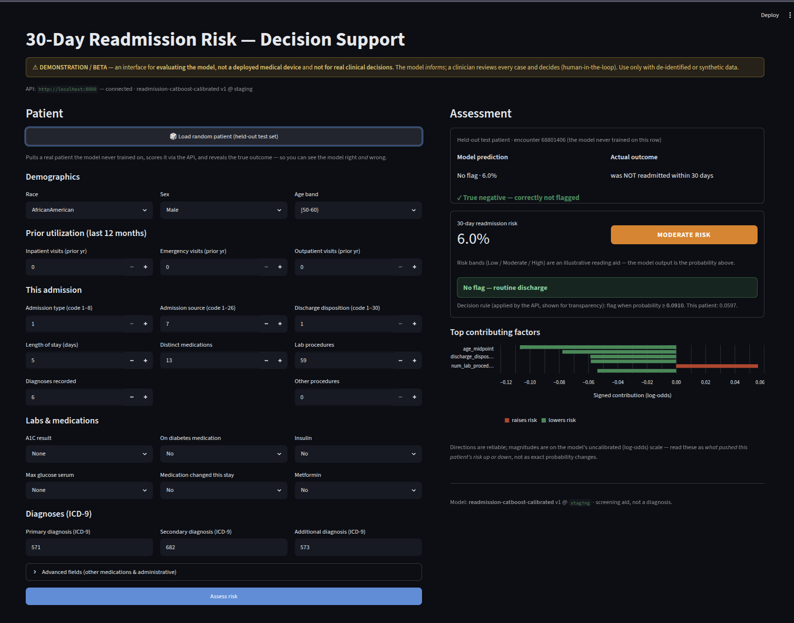
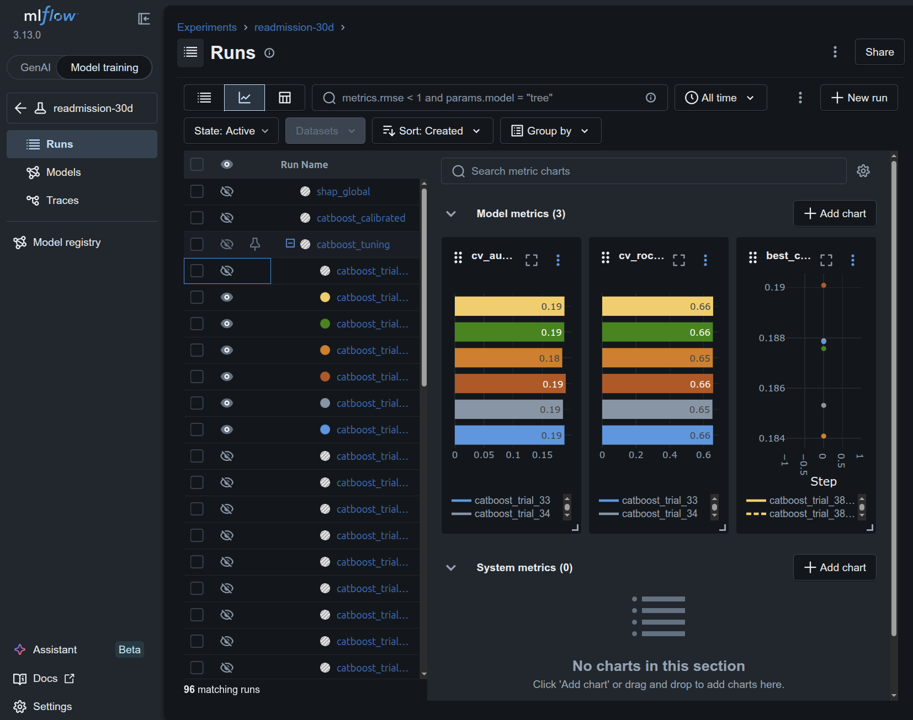
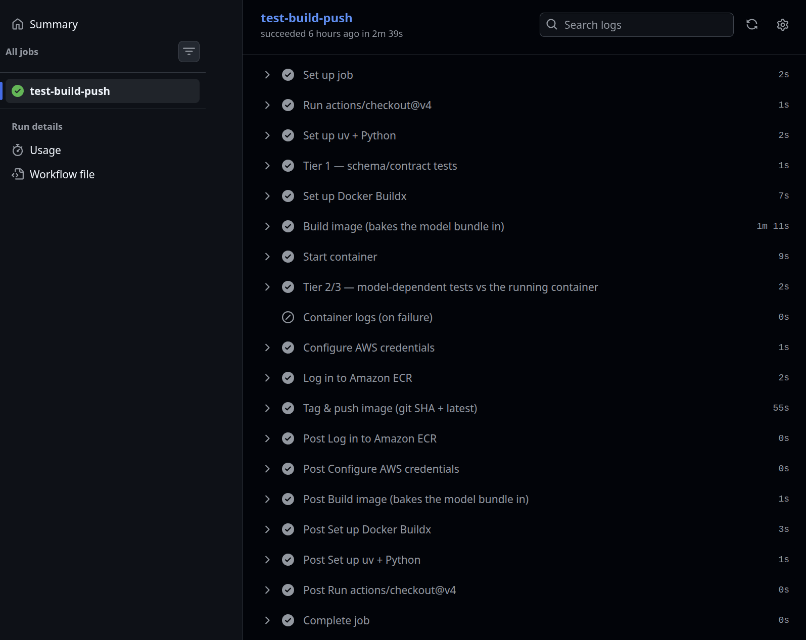
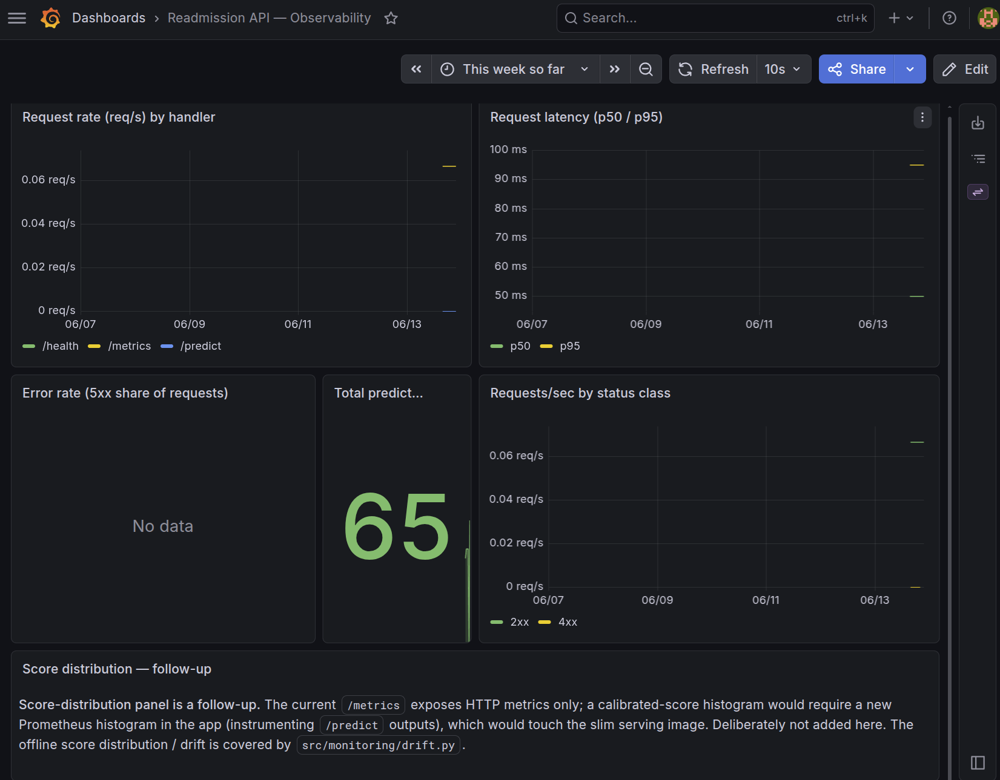
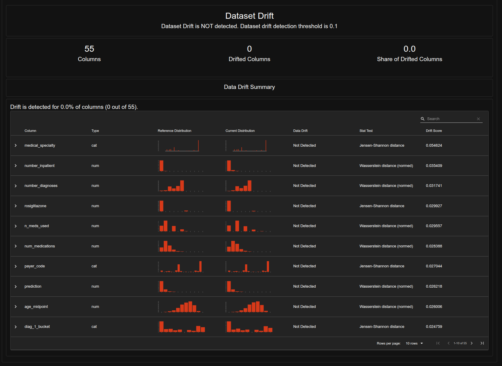

# 30-Day Hospital Readmission Risk — Production ML System

[](https://github.com/feb-in/fde_advanced_week1_project/actions/workflows/ci.yml)

Predicts, **at discharge**, the probability a diabetic patient is readmitted
within 30 days — and takes that prediction all the way to a **running, monitored,
governed service**, not a notebook model.

> **Start here:** `CLAUDE.md` is the build manual (read automatically by Claude
> Code). Then `docs/PROJECT_BRIEF.md` (problem + graded traps) and
> `docs/GOALS.md` (the authoritative staged plan and definition of done).

## What this system includes

A full ML lifecycle, not just a model — every surface below is real code in this repo:

| Surface | Where |
|---|---|
| **Reproducible data pipeline** — DVC: validate → clean → featurize → validate | `dvc.yaml` · `src/data/` · `src/features/` |
| **Experiment tracking** — MLflow runs + model registry (`@staging`) | `src/models/` (`train`·`tune`·`calibrate`) · `mlflow.db` |
| **FastAPI service** — `/predict` (calibrated risk + SHAP), `/health`, real `/metrics` | `src/app/` |
| **Streamlit decision-support UI** — thin `/predict` client; load-random-patient truth-vs-prediction | `src/ui/` |
| **Containerization** — slim rootless image, model baked in (Podman) | `deploy/Containerfile` · `deploy/model_bundle/` |
| **CI/CD → Amazon ECR** — test-gated build + push on green | `.github/workflows/ci.yml` |
| **Observability** — Prometheus + Grafana dashboard + 3 alert rules | `compose.yaml` · `deploy/prometheus.yml` · `deploy/alerts.yml` · `deploy/grafana/` |
| **Drift detection + retrain trigger** — Evidently; validated firing on a shifted batch | `src/monitoring/drift.py` · `retrain_trigger.py` |
| **Governance** — Fairlearn audit, global+local SHAP, per-request audit log, model card | `src/governance/` · `src/app/audit.py` · `docs/MODEL_CARD.md` · `docs/FAIRNESS_AUDIT.md` |
| **Reflection** — trade-offs, production gaps, model limits | `docs/REFLECTION.md` |

## Stack
Python 3.12 · **uv** · scikit-learn / **CatBoost** · MLflow · DVC · FastAPI ·
SHAP · Fairlearn · Evidently · Prometheus + Grafana · **Podman** (not Docker).

**Deployment:** the container image is **built, tested, and pushed to Amazon ECR by
GitHub Actions CI/CD** on every green push to `main` — a one-command-deployable artifact.
A live AWS/Fargate service is **not** stood up here; the published ECR image is the
deployable deliverable.

## Layout (cookiecutter-data-science flavour)
```
docs/         brief, goals, feature log, model comparison/card, threshold, fairness,
              reflection, serving, monitoring, data validation, RESUME_HERE (checklist)
src/
  contracts/  data_contract.py · input_contract.json  — single source of truth for inputs
  data/       clean.py · validate.py    — reproducible cleaning + GX suites → data/processed/
  features/   build_features.py         — Strack-9 ICD-9 + engineered features → data/featurized/
  models/     train.py · tune.py · calibrate.py · evaluate.py · wrappers.py — MLflow-logged
  app/        FastAPI service: /predict (+ SHAP), /health, real /metrics; audit.py
  monitoring/ make_reference.py · drift.py (Evidently) · retrain_trigger.py
  governance/ fairness.py (Fairlearn) · explain.py (global SHAP)
  ui/         app_streamlit.py — thin /predict client (+ random held-out patient demo)
deploy/       Containerfile · export_model.py · model_bundle/ · prometheus.yml · alerts.yml · grafana/
compose.yaml  api + prometheus + grafana stack (Podman/Docker-compatible)
data/         raw/ processed/ featurized/ monitoring/   (DVC-tracked, gitignored)
EDA/          exploratory analysis (Streamlit dashboard + analysis engine)
tests/        smoke + 3-tier suite (schema / skew / behaviour / container)
dvc.yaml      validate_raw → clean → featurize → validate_processed (`dvc repro`)
.github/      workflows/ci.yml — test-gated build → push to Amazon ECR
```

## Quickstart
```bash
# 1. environment (uv is the source of truth; pyproject.toml + uv.lock are pinned)
uv sync

# 2. data — PRIMARY path (no credentials): place the raw Kaggle CSV at
#    data/raw/diabetic_data.csv, then rebuild the whole dataset:
dvc repro                     # validate_raw → clean → featurize → validate_processed → make_reference
#    OPTIONAL (if you have DagsHub access): fetch the tracked data instead of rebuilding
# dvc pull -r origin

# 3. train: LR baseline + CatBoost, logged to MLflow (sqlite:///mlflow.db by default)
uv run python src/models/train.py
mlflow ui --backend-store-uri sqlite:///mlflow.db        # → http://localhost:5000

# 4. serve + monitor: build the slim image, bring up api + prometheus + grafana
uv run python deploy/export_model.py
podman compose up --build -d  # API :8000 · Prometheus :9090 · Grafana :3000 (admin/admin)
curl -s -X POST localhost:8000/predict -H 'Content-Type: application/json' \
     --data-binary @tests/sample_request.json           # → 0.074595

# 5. demo UI (separate process; thin /predict client; dark theme via .streamlit/config.toml)
READMISSION_API_URL=http://localhost:8000 uv run --group ui \
     streamlit run src/ui/app_streamlit.py              # → http://localhost:8501
```
Governance + monitoring artifacts: `uv run python src/governance/fairness.py`,
`… explain.py`, `src/monitoring/drift.py`, `… retrain_trigger.py`.

## How to see it live

The repo is the deliverable; here is how to bring up each surface locally.

```bash
# 0. one-time: bake the registered @staging model into the deploy bundle
uv run python deploy/export_model.py

# 1. the stack — API + Prometheus + Grafana (Podman; Docker-compatible)
podman compose up --build -d
#   API         http://localhost:8000   /health · /predict · /metrics
#   Prometheus  http://localhost:9090   Status → Targets (UP) · Status → Rules (3 alerts)
#   Grafana     http://localhost:3000   login admin / admin → "Readmission API — Observability"

# score the golden patient (calibrated risk + flag + top SHAP factors)
curl -s -X POST localhost:8000/predict -H 'Content-Type: application/json' \
     --data-binary @tests/sample_request.json            # → 0.074595

# 2. the decision-support UI (separate process; thin /predict client; dark theme)
READMISSION_API_URL=http://localhost:8000 uv run --group ui \
     streamlit run src/ui/app_streamlit.py               # → http://localhost:8501

# 3. the drift report (Evidently: control vs shifted) + the retrain decision
uv run python src/monitoring/drift.py                    # → reports/monitoring/drift_*.html
uv run python src/monitoring/retrain_trigger.py          # control → keep · shifted → RETRAIN

# 4. experiment tracking
mlflow ui --backend-store-uri sqlite:///mlflow.db        # → http://localhost:5000
```
Stop the stack with `podman compose down`.

## Screenshots / Evidence

*Static proof the surfaces above actually run.*

### Reproducible data pipeline — DVC DAG

The DVC pipeline graph — the versioned data lineage from the raw CSV through validation,
cleaning, and featurization. Blue nodes are DVC-managed data artifacts (raw CSV,
processed/featurized parquets, drift reference), teal are the git-managed scripts; one
`dvc repro` rebuilds the whole chain from the raw CSV.

### Decision-support UI — truth vs prediction

The thin-client UI scoring a real **held-out-test** patient (one the model never trained
on): calibrated risk, the follow-up flag, top SHAP factors, and the model's call checked
against the actual 30-day outcome — here a ✓ true negative; right *and* wrong calls are
shown openly.

### Experiment tracking — MLflow

The MLflow UI for the `readmission-30d` experiment — every model attempt logged with its
metrics (PR-AUC, ROC-AUC, …) and artifacts, plus the registered calibrated model: a
reproducible, inspectable experiment history rather than ad-hoc notebook runs.

### CI/CD — green pipeline

A green GitHub Actions run: schema tests → image build → container tests (golden score
**0.074595**) → push to **Amazon ECR**. Every change is gated by the test suite.

### Grafana dashboard — live service metrics

The provisioned *"Readmission API — Observability"* dashboard reading real Prometheus
metrics: request rate by handler, p50/p95 latency, total predictions served (65 here),
and requests/sec by status class. (The 5xx error-rate panel reads "No data" — there were
no server errors.)

### Drift detection — Evidently report

An Evidently data-drift report (`src/monitoring/drift.py`) on the deliberately **shifted**
batch — **dataset drift detected**, 8 of 55 columns (share 0.145): the shifted features
(`number_inpatient`, `service_utilization`, `age_midpoint`, `diag_1_bucket`, …) **and the
prediction** are flagged, while the in-distribution **control** batch stays silent. Both
reports: `reports/monitoring/drift_{control,shifted}.html`.

## Status — all stages complete
- ✅ **Stages 1–4** — env/DVC, reproducible cleaning + GX validation, deterministic
  featurization, LR baseline + CatBoost (Optuna), calibration + threshold, registered.
- ✅ **Stage 5** — FastAPI + slim Podman container + compose stack; **CI/CD → Amazon ECR**
  (GitHub Actions, green).
- ✅ **Stage 6** — real `/metrics`, Grafana dashboard, 3 Prometheus alert rules, Evidently
  drift (validated), concrete retrain trigger.
- ✅ **Stage 7** — Fairlearn fairness audit, global+local SHAP, per-request audit log,
  model card, reflection.
- ✅ **Demo UI** — thin-client Streamlit with a load-random-held-out-patient
  truth-vs-prediction demo.
- ⬜ **Remaining** — verify clean-checkout reproducibility end-to-end;
  optional AWS Fargate live deploy.

## Reproducibility

**Primary path (no credentials needed):** rebuild the dataset from the raw CSV. Obtain the
raw Kaggle CSV, place it at `data/raw/diabetic_data.csv`, and run `dvc repro` — it runs
the full pipeline (`validate_raw → clean → featurize → validate_processed → make_reference`)
and regenerates the processed/featurized parquets and the drift reference. This is the
supported default and needs no external access.

**Optional convenience (if you have DagsHub access):** the DVC-tracked data (raw CSV,
processed + featurized parquets, drift reference) is also pushed to a **DagsHub DVC
remote**, so `dvc pull -r origin` fetches it instead of rebuilding. This requires DagsHub
authentication, so it's optional — the rebuild path above remains the primary method. See
`docs/RESUME_HERE.md` (submission checklist) for the full done-vs-left list.

## Headline metrics (not accuracy)
The positive class is ~9%, so accuracy is a trap. We report **PR-AUC**, **recall
at a fixed precision**, and **calibration (Brier)**. Healthy range on this dataset:
ROC-AUC ~0.66–0.70, AUPRC ~0.20–0.30. A leakage tripwire stops us if test
ROC-AUC > 0.75.
